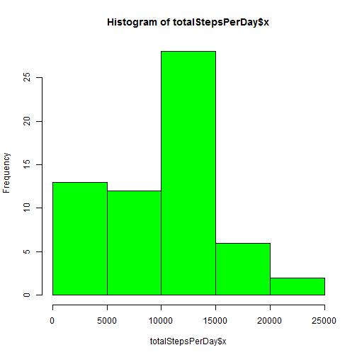
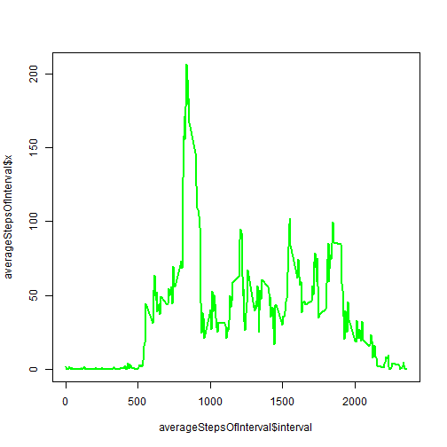
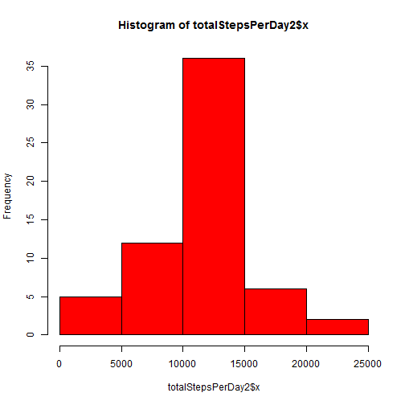

# Reproducible Research: Peer Assessment 1
It is now possible to collect a large amount of data about personal movement using activity monitoring devices such as a Fitbit, Nike Fuelband, or Jawbone Up. These type of devices are part of the “quantified self” movement – a group of enthusiasts who take measurements about themselves regularly to improve their health, to find patterns in their behavior, or because they are tech geeks. But these data remain under-utilized both because the raw data are hard to obtain and there is a lack of statistical methods and software for processing and interpreting the data.

This assignment makes use of data from a personal activity monitoring device. This device collects data at 5 minute intervals through out the day. The data consists of two months of data from an anonymous individual collected during the months of October and November, 2012 and include the number of steps taken in 5 minute intervals each day.

## Loading and preprocessing the data

```r
d <- read.csv("activity.csv")
# change format
d$date <- as.Date(x=d$date)
```
## What is mean total number of steps taken per day?

- Make a histogram of the total number of steps taken each day

```r
totalStepsPerDay <- aggregate(x=d$steps,by=list(date = d$date),FUN=sum,na.rm=TRUE)

hist(totalStepsPerDay$x,col="green")
```

 

- Calculate and report the mean and median total number of steps taken per day.

```r
m <- mean(totalStepsPerDay$x)
m
```

```
## [1] 9354
```

```r
med <- median(totalStepsPerDay$x)
med
```

```
## [1] 10395
```

> **The mean is 9354.2295, and median is 10395**

## What is the average daily activity pattern?
- Make a time series plot (i.e. type = "l") of the 5-minute interval (x-axis) and the average number of steps taken, averaged across all days (y-axis)

```r
averageStepsOfInterval <- aggregate(x=d$steps,by=list(interval=d$interval),FUN=mean,na.rm=TRUE)

plot(x=averageStepsOfInterval$interval,y=averageStepsOfInterval$x,type="l",lwd=2,col="green")
```

 

- Which 5-minute interval, on average across all the days in the dataset, contains the maximum number of steps?

```r
maxInterval <- averageStepsOfInterval[averageStepsOfInterval$x == max(averageStepsOfInterval$x),]
maxInterval
```

```
##     interval     x
## 104      835 206.2
```

> **Interval 835 contains the maximum steps 206.1698**

## Imputing missing values
- Calculate and report the total number of missing values in the dataset (i.e. the total number of rows with NAs)

```r
incompleteRows <- d[!complete.cases(d),]
nrow(incompleteRows)
```

```
## [1] 2304
```

- Devise a strategy for filling in all of the missing values in the dataset. The strategy does not need to be sophisticated. For example, you could use the mean/median for that day, or the mean for that 5-minute interval, etc.
- Create a new dataset that is equal to the original dataset but with the missing data filled in.

```r
# create a new dataset call 'd2' exactly the same as original 'd'
d2 <- d
# fill in 'NA' observations in d2 with the 'average steps of interval'
for(i in 1:nrow(d2)) {
  if(is.na(d2[i,"steps"])) {
    d2[i,"steps"] <- averageStepsOfInterval[averageStepsOfInterval$interval == d2[i,"interval"], "x"]
  }
}
```

and now we have a new dataset with complete observations


```r
head(d2)
```

```
##     steps       date interval
## 1 1.71698 2012-10-01        0
## 2 0.33962 2012-10-01        5
## 3 0.13208 2012-10-01       10
## 4 0.15094 2012-10-01       15
## 5 0.07547 2012-10-01       20
## 6 2.09434 2012-10-01       25
```

- Make a histogram of the total number of steps taken each day and Calculate and report the mean and median total number of steps taken per day. Do these values differ from the estimates from the first part of the assignment? What is the impact of imputing missing data on the estimates of the total daily number of steps?

```r
totalStepsPerDay2 <- aggregate(x=d2$steps,by=list(date = d2$date),FUN=sum)

hist(totalStepsPerDay2$x,col="red")
```

 

and the new mean, median should be

```r
m2 <- mean(totalStepsPerDay2$x)
m2
```

```
## [1] 10766
```

```r
med2 <- median(totalStepsPerDay2$x)
med2
```

```
## [1] 10766
```

> **The mean is 1.0766 &times; 10<sup>4</sup>, which is greater than the original mean 9354.2295, and median is 1.0766 &times; 10<sup>4</sup>, which is also greater than the original median 10395**

## Are there differences in activity patterns between weekdays and weekends?

- Create a new factor variable in the dataset with two levels – “weekday” and “weekend” indicating whether a given date is a weekday or weekend day.

```r
Sys.getlocale(category = "LC_ALL")
```

```
## [1] "LC_COLLATE=Chinese (Traditional)_Taiwan.950;LC_CTYPE=Chinese (Traditional)_Taiwan.950;LC_MONETARY=Chinese (Traditional)_Taiwan.950;LC_NUMERIC=C;LC_TIME=Chinese (Traditional)_Taiwan.950"
```
> i'm using "Chinese Traditional Taiwan" as my current locale, so the code below may contain some chinese.


```r
# create a new factor variable 'status' with 2 levels: 'weekday', 'weekend'
status <- factor(c("weekday","weekend"))
# evalute each row in the dataset, assign status='weekend' if it's among saturday or sunday, and vise versa for status='weekday'
for(i in 1:nrow(d2)) {  
  if(weekdays(d2[i,"date"]) %in% c("星期六","星期日")) {
    d2[i,"status"] <- status[2]
  }else{
    d2[i,"status"] <- status[1]
  }
}
head(d2)
```

```
##     steps       date interval  status
## 1 1.71698 2012-10-01        0 weekday
## 2 0.33962 2012-10-01        5 weekday
## 3 0.13208 2012-10-01       10 weekday
## 4 0.15094 2012-10-01       15 weekday
## 5 0.07547 2012-10-01       20 weekday
## 6 2.09434 2012-10-01       25 weekday
```

- Make a panel plot containing a time series plot (i.e. type = "l") of the 5-minute interval (x-axis) and the average number of steps taken, averaged across all weekday days or weekend days (y-axis).

```r
averageStepsOfInterval2 <- aggregate(x=d2$steps,by=list(interval=d2$interval,status=d2$status),FUN=mean)

library(lattice)

xyplot(averageStepsOfInterval2$x~averageStepsOfInterval2$interval|averageStepsOfInterval2$status,type="l",xlab="Interval",ylab="Number of steps",layout=c(1,2))
```

 


